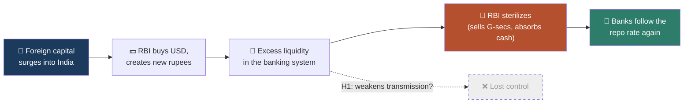
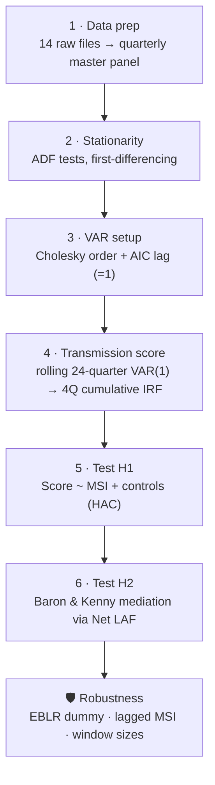

<div align="center">

# 🧭 Navigating the Dilemma

### Sterilization and Monetary Transmission in Emerging Markets

*When a flood of foreign money hits India, does the RBI lose the steering wheel?*
*Spoiler: not really. It has a vacuum cleaner.*


**Keywords:** Impossible Trinity · Global Financial Cycle · Monetary Transmission · Sterilization · India · TVP-VAR

</div>

---

## ⚡ TL;DR

- **Question:** Does foreign capital flowing into India weaken the RBI's grip on bank lending rates (Rey's "Dilemma")?
- **Finding:** No. Higher foreign inflows are associated with *stronger* transmission, and the effect runs almost entirely **through RBI's liquidity sterilization**.
- **How:** A rolling VAR measures how well RBI's repo-rate moves reach bank lending rates each quarter. A custom **Money Source Index (MSI)** measures how much of India's money growth is foreign-sourced. A Baron & Kenny mediation test connects the dots.
- **Everything here is reproducible:** 14 raw data files, a scraper, and one notebook that runs the whole thing top to bottom.

---

## 🧠 The 60-second version (no economics degree required)

Imagine a country can only have **two** of these three things:

| | |
|---|---|
| 🎛️ **Control its own interest rates** | Independent monetary policy |
| 🔒 **Fix its currency's value** | Fixed exchange rate |
| 🌊 **Let money flow in and out freely** | Open capital account |

That's the classic **Trilemma**. In 2013, economist Hélène Rey argued it's really a **Dilemma**: if money flows freely, your interest-rate independence is already compromised, no matter what your currency does. Global investors' mood swings (driven largely by the US Fed) wash over everyone.

This hits **emerging markets** hardest, because their foreign money comes in big waves and leaves just as fast.

**So here's what this project asks about India:**

1. Foreign investors pour dollars in and need rupees.
2. The RBI buys those dollars (to stop the rupee from shooting up and killing exporters) and **prints new rupees** in exchange.
3. Banks are now swimming in cash. They don't need the RBI's rate signals as much. 😬
4. To fix it, the RBI **sterilizes**: it sells government bonds to banks and sucks the extra rupees back out. 🧹

**Does that last step save monetary policy? The data says yes.**



---

## 🎯 Hypotheses

| | Hypothesis | Verdict |
|---|---|---|
| **H1** | Foreign capital inflows *impair* domestic monetary transmission | ❌ **Not supported.** The effect is positive, the opposite of a naive reading of Rey |
| **H2** | Foreign inflows trigger active sterilization, which *strengthens* transmission | ✅ **Supported.** Sterilization fully mediates the effect |

---

## 📊 Key results

> **Transmission score** = how many basis points bank lending rates (PLR) rise over the next 4 quarters after a 100 bps repo hike. A score of **1.0 = full pass-through.**

| Test | Coefficient | Significance | What it says |
|---|---|---|---|
| Contemporaneous MSI → Score | **+0.82** | p < 0.01 | More foreign money, stronger transmission |
| Lagged MSI (t−1) → Score, HAC errors | **+0.72** | p < 0.01 | Holds after fixing simultaneity and autocorrelation |
| With EBLR regime control | **+0.83** | p < 0.01 | Not an artefact of the 2019 lending-rate reform |
| **Link 1:** MSI → Net LAF | **−33.28** | p < 0.01 | More inflow, more liquidity absorbed *(negative = RBI absorbing)* |
| **Link 2:** Net LAF → Score | **−0.0195** | p < 0.01 | More absorption, stronger transmission |
| **Link 3 (horse race):** MSI direct effect | **+0.04** | p = 0.75 | **Vanishes** once sterilization is in the model |
| **Link 3 (horse race):** Net LAF | **−0.0195** | p < 0.01 | **Survives.** This is the full-mediation signature |
| Window robustness (4 / 5 / 6 yr) | positive | significant in 2 of 3 | 4-year window loses power (fewer observations) |

**Bottom line:** the RBI isn't a passive victim of the global financial cycle. Active balance-sheet management is a practical "third way" that doesn't require capital controls.

---

## 🔬 How it was done



**The two custom building blocks**

- **Money Source Index (MSI)** = (4-quarter sum of FPI debt inflows + NRI deposit inflows) ÷ (4-quarter sum of ΔM3). *"What share of India's money growth came from abroad?"*
- **Transmission Score** = 4-quarter cumulative orthogonalized impulse response of the bank prime lending rate to a repo-rate shock, from a **VAR(1) rolled over 24-quarter windows**. This is how the "time-varying" part is done.

**VAR variables** (Cholesky order, slowest → fastest): `CPI inflation Δ` → `M3 growth` → `Repo rate Δ` → `PLR Δ`

**Controls:** GovShare (government borrowing ÷ ΔM3), Brent crude YoY, EBLR-regime dummy (post Oct 2019).

---

## 🗂️ Data

Everything lives in this repo. **14 files, 4 origins, 1 messy afternoon.**

| File | What it is | Source |
|---|---|---|
| `policy_rates.xls` | Repo rate | ACE Knowledge Portal → Money and Banking |
| `lending___deposit_rates.xls` | Prime lending rate (PLR) | ACE KP → Money and Banking |
| `consumer_price_index.xls` | CPI inflation | ACE KP → CPI, WPI & Inflation |
| `components_of_money_stock__monthly_.xls` | Broad money (M3) | ACE KP → Money Stock |
| `nri_deposits_net_of_inflow_and_outflow.xls` | NRI deposit flows | ACE KP → Trade & BoP → NRI Deposits |
| `market_borrowings_of_central_and_state_governments.xls` | Government borrowing | ACE KP → Public Finance |
| `forex_rate_usd.xls` | USD/INR | ACE KP → Forex |
| `quarterly_gdp_at_current_prices__base_year_201112.xls` | Nominal GDP (quarter spine) | ACE KP → National Income Statistics |
| `key_deficit_indicators_of_the_central_government.xls` | Fiscal deficit | ACE KP → Public Finance |
| `balance_of_payment_in_usd_qrtrly.xls` | Current account *(dropped: gaps after 2019)* | ACE KP → Trade & BoP |
| `indias_foreign_trade_usd_monthly.xls` | Trade openness | ACE KP → Trade & BoP |
| `master_wpi_index.xlsx` | WPI (food) | ACE KP → CPI, WPI & Inflation |
| `fpi_data_2000_2025_FINAL.csv` | FPI debt flows (daily) | **NSDL FPI Monitor**, scraped with Selenium |
| `brent_crude_fred.csv` | Brent crude price | **Yahoo Finance** |
| `rbi_liquidity_quarterly_panel.csv` | Net LAF (sterilization intensity) | RBI liquidity operations |
| `msi_master_table.csv` | **Output:** assembled master panel | Built by the notebook |

The paper's **Appendix A** documents every source, menu path, coverage window, and transformation in full.

> 💡 *The ACE/RBI "`.xls`" files are actually HTML tables wearing an Excel costume. The notebook parses them with `pandas.read_html`.*

---

## 🚀 Run it yourself

```bash
# 1. Clone
git clone https://github.com/priyanshrm/navigating_the_dilemma.git
cd navigating_the_dilemma

# 2. Install
pip install pandas numpy statsmodels matplotlib scipy lxml beautifulsoup4 html5lib openpyxl jupyter

# 3. Run (launch from the repo folder, since paths are relative)
jupyter notebook paper_pipeline.ipynb
```

Then **Run All**. The notebook walks through the paper in order:

| Notebook section | Paper section |
|---|---|
| Phase 1: Data preparation | §4.1 |
| Phase 2: Stationarity and differencing | §4.2 |
| Phase 3: Cholesky ordering and lags | §4.2 |
| Phase 4: Time-varying transmission score | §4.3.1 |
| Testing H1 | §5.1 |
| Testing H2 (mediation) | §5.2 |
| Robustness checks | §5.3 |
| Figures | Fig. 1 and Fig. 2 |

**Rebuilding the FPI file from scratch?** Run `fpi_scrapper.py` (Selenium, month-by-month from NSDL) and then `merge_fpi_dbs.py` (stitches the chunks into one table).

```bash
python fpi_scrapper.py --start-year 2000 --end-year 2025
python merge_fpi_dbs.py 2000 2025
```

---

## 📁 Repo map

```
navigating_the_dilemma/
├── paper_pipeline.ipynb        # 👈 start here: the whole analysis, in paper order
├── msi_master_table.csv        # assembled quarterly master panel (output)
├── rbi_liquidity_quarterly_panel.csv   # Net LAF panel (needed for §5.2 + figures)
├── fpi_scrapper.py             # NSDL FPI scraper (Selenium)
├── merge_fpi_dbs.py            # merges scraper chunks into one table
├── fpi_data_2000_2025_FINAL.csv
├── brent_crude_fred.csv
├── master_wpi_index.xlsx
└── *.xls                       # 11 ACE Knowledge Portal exports (RBI series)
```

---

## 🧭 Reader's guide

**👔 Recruiters / hiring managers**
This project covers the full workflow: *scraping → wrangling messy government data → time-series econometrics → causal-channel testing → a written paper and reproducible code.* Skills on display:

- **Data engineering:** Selenium scraper with retries, SQLite chunk-and-merge, parsing HTML-disguised Excel files, aligning daily, monthly, quarterly and annual series onto one quarterly spine
- **Econometrics:** ADF tests, VAR, orthogonalized IRFs, rolling estimation, Newey-West HAC errors, Granger causality, Baron & Kenny mediation
- **Python stack:** pandas, NumPy, statsmodels, matplotlib
- **Communication:** a LaTeX paper, publication-style figures, and honest limitations

**🎓 Professors / reviewers**
Jump to *Key results* and *How it was done*, then the paper. Limitations are stated plainly below. Identification is associational, not causal, and I'd welcome suggestions on instruments or alternative transmission measures.

**🤝 Colleagues / collaborators**
The notebook is modular (one function per phase) and mirrors the paper's section numbering. Forks and PRs welcome, especially for longer samples, MCLR/EBLR-based transmission measures, or other EMEs.

**🌱 Students new to econ**
Start with *The 60-second version*, skim the glossary below, then open the notebook. Every phase prints plain-English output. It's a decent first example of how a macro paper goes from idea to regression.

---

## 📖 Mini glossary

| Term | Plain English |
|---|---|
| **Repo rate** | The RBI's main policy interest rate, the "steering wheel" |
| **PLR** | Prime Lending Rate, what banks charge their best borrowers; our proxy for the lending rate |
| **M3** | Broad money supply: total liquidity in the economy |
| **FPI** | Foreign Portfolio Investment: foreigners buying Indian stocks and bonds |
| **NRI deposits** | Money non-resident Indians park in Indian banks |
| **LAF** | Liquidity Adjustment Facility, the RBI's daily tool to inject or absorb cash. *Negative Net LAF = absorbing* |
| **Sterilization** | Offsetting the money created by buying foreign currency, e.g. by selling government bonds |
| **EBLR** | External Benchmark Lending Rate, the post-2019 rule linking loan rates directly to the repo rate |
| **VAR / IRF** | Vector autoregression / impulse response: "if I shock X today, how does Y react over time?" |
| **HAC (Newey-West)** | Standard errors that stay honest when residuals are autocorrelated |
| **Mediation** | Testing whether A affects C *through* B (here: inflows → sterilization → transmission) |

---

## ⚠️ Honest limitations

- **Short sample:** 45 quarters (2014Q1–2025Q3), so statistical power is limited.
- **Association, not proof of causation:** Granger tests do *not* find that MSI predicts the transmission score at 1–2 lags (p ≈ 0.25 / 0.28). The mediation evidence is regression-based.
- **Generated regressor:** the transmission score comes from rolling-window estimates, so overlapping windows induce serial correlation (handled with HAC errors, not eliminated).
- **Time variation via rolling windows:** a practical approximation to a full Bayesian TVP-VAR.
- **Lending-rate proxy:** the source files contain PLR but no MCLR series, so PLR midpoints stand in for transmission to lending rates.
- **Window sensitivity:** the effect is significant for 5- and 6-year windows but not for the 4-year window.

---

## 📚 Standing on the shoulders of

- Rey, H. (2013). *Dilemma not trilemma: The global financial cycle and monetary policy independence.* Jackson Hole Symposium.
- Primiceri, G. (2005). *Time varying structural vector autoregressions and monetary policy.* Review of Economic Studies.
- Bernanke, B. & Gertler, M. (1995). *Inside the black box: The credit channel of monetary policy transmission.* Journal of Economic Perspectives.
- Baron, R. & Kenny, D. (1986). *The moderator–mediator variable distinction in social psychological research.* JPSP.
- Patra et al. (2024); Kumawat (2024, 2025); Phul (2024); Alex (2025) on Indian monetary transmission

*(Full reference list in the paper.)*

---

## 📝 Cite this

```bibtex
@misc{navigating_the_dilemma,
  title  = {Navigating the Dilemma: Sterilization and Monetary Transmission in Emerging Markets},
  author = {Priyansh},
  year   = {2026},
  url    = {https://github.com/priyanshrm/navigating_the_dilemma}
}
```

---

<div align="center">

**Built with curiosity, too much chai, and a Selenium scraper that was only mildly rude to NSDL's servers.**

⭐ If this helped you, a star is always appreciated. Questions or ideas? Open an issue.

</div>
